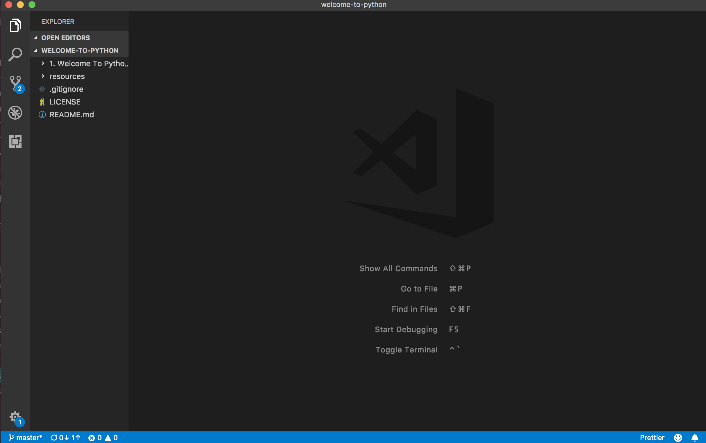
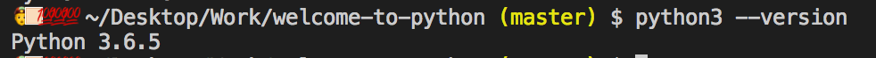

# Hi Vinh, welcome to Python 3
Here's a quick crash course on Python and important CS concepts (WIP lol). We won't focus too much on command line topics or Git, and we'll be relying on the GUI and CodeAcademy.

## Table of Contents
- [Introduction](#introduction)
- [Setup](#setup)
    - [VSCode](https://code.visualstudio.com/) : _universal code editor, works with terminal/cli_
    - Python 3 for [Windows](https://www.python.org/downloads/windows/) /
 [MacOS](https://www.python.org/downloads/mac-osx/) 
     - [Git basics](https://www.codecademy.com/learn/learn-git) (_optional_)
     - [Command Line Basics](https://www.codecademy.com/learn/learn-the-command-line) (_optional_)
     - Alternatively, you don't have to save your work on your computer if you run Python on an [online compiler](http://rextester.com/l/python3_online_compiler)
- [Module One](#module-one)
- [Module Two](#module-two)
- [Module Three](#module-three)
- [Module Four](#module-four)

# Introduction
**What is Python?**
- A general purpose programming language from the 80s - although it's a bit of the older side it's still being used extensively today, with the 5th largest StackOverflow community, and one of the most in-demand languages in the data industry
- We'll be using Python 3 as opposed to Python 2. The big ideas between the two languagues are still the same, the syntax is just a bit different

**Why Python?**
- Python handles a lot of under-the-hood complexities for its user, so you can pretty much focus on writing code that functions without worrying about things like memory management
- Python is probably one of the better first imperative languages to learn because it's written like English. It's quite easy to pick up, and you don't have to worry about the low level problems you would encounter in a language like C++, yet it's strict enough to throw errors and will not fail silently (yikes, Javascript)
- You can also build backends, pipelines, mine data - you can do almost anything with Python

**How Will This Work?**
- The idea is that you learn syntax (how Python is written) and basic concepts from a free online resource: CodeAcademy. This has two major benefits, with the first being that I can skip an entire chapter of documentation on basic syntax, and the second being that we can focus more on algorithms and real world problem solving.
- You can also choose to either download Python and a text editor so you have it availiable offline, or you can skip the installation and use an online compiler.

# Setup
## Installation-Free Method:
http://rextester.com/l/python3_online_compiler
## Installing Python for Offline Use:
For the purposes of the tutorial, it's better to standardize our setup as much as possible. This way, when there's an error, we don't have to worry about error messages not matching, cross-platform inconsistencies, etc.

1. Begin by [Visual Studio Code](https://code.visualstudio.com/). We can quickly access the command line using VSCode, so that we don't have to constantly _cd_ into different folder structures.
2. Your next download is [Python](https://www.python.org/downloads/windows/). Make sure you download the correct version of Python (3.x) for your OS (Mac/Windows/Linux). We need this when we eventually run Python from our command line.
3. After everything has been installed, open up your Visual Studio Code. Drag and drop the welcome-to-python folder you've downloaded onto the VS Code client. We should have something like this:
<br><br>

<br><br>
Right click on the space below your workspace and click "Open in Terminal":
<br><br>

<br><br>
Now, let's check to see if we have Python installed properly.
<br><br>
_For Windows, type in: py to enter Python shell and then exit() to quit_
<br><br>
_For MacOS, Python 2.7 comes preinstalled, and that's the version that will be executed for what I assume to be backwards compatibility issues. We would type in python3 --version_ to check.
<br><br>

<br><br>
If everything is done correctly, Python 3.x.x should be installed! (If not, please find your nearest Ben and ask to debug)
<br><br>

<br><br> 
4. Now type "python welcome.py" into your terminal. This effectively runs the Python file I've created. This should print something to your console. Congrats, Python is now working correctly on your machine!
_Note: In the future, if you save Python files to your computer, you have to be in the same directory as the file to run it!_

# Module One
## Syntax, Primitives, and Basic Math
This module won't be too hefty - the main purpose is to understand primitives and basic syntax. We'll move faster and cover more ground in the later modules!

### Readings / Lecture
Finish the first track (from 1 - 14) of the Python CodeAcademy course: https://www.codecademy.com/courses/learn-python/lessons/python-syntax/exercises/print-statements

A really useful Code Academy track is the command line one - this gives you basic commands and allows you to nagivate through your system without the use of a GUI - super helpful when you're working in a directory on your command line and have to move to another, open a file, run tests, etc.

### Exercises and Answers
After you finish, try some of the excersies in this file (either create a new Python file and run it locally, or use the online compiler):

https://github.com/ben-che/welcome-to-python/blob/master/Module%20One/index.py

Answers will be found here:

https://github.com/ben-che/welcome-to-python/blob/master/Module%20One/answer.py

### Additional Resources
- [Interactive Command Line Tutorial](https://www.codecademy.com/learn/learn-the-command-line)

- [Command Line Cheatsheet](https://www.git-tower.com/blog/command-line-cheat-sheet/)

# Module Two
## Functions and Conditional Flow
Conditional flow is one of the key concepts you'll find across almost all programming languages - this is the logic that dictates what happens under what conditions. Furthermore, conditional flow is often encased in functions._

_One way to think of functions is to think of them like people in an office. Different people have different names and do different things. For example, if I worked in an office and my sole purpose was to get coffee for others, then to get get coffee, you would say "Ben, take this $5 and please get me a coffee". Similarily, with Python, we can define functions by giving them names and jobs, and once we're finished defining what they do, we simply call them by their name and give them any arguments they need.

If I were to define the Ben function and give it behaviour in pseudocode:
```
def Ben(money):
    if (money > 0):
        return Coffee
    else
        return None
```

Before you dive in there's going to be a large jump in difficulty from the previous module, and this is only because you'll be exposed to I/O and functions. If you have any questions please ask me, and I'll do my best to help out!

### Readings / Lecture

Finish the control flow track from Code Academy to learn syntax:
https://www.codecademy.com/courses/learn-python/lessons/conditionals--control-flow/exercises/go-with-the-flow?action=resume_content_item

Finish the functions track to learn function declaration, definition and invocation:

https://www.codecademy.com/courses/learn-python/lessons/functions/exercises/what-good-are-functions?action=resume_content_item

This is also a good resource for Python control flow, complete with state diagrams to help hammer points home (Read only from 4.1 - 4.42):
http://www.openbookproject.net/books/bpp4awd/ch04.html

### Exercises and Answers

After you finish, try some of the excersies in this file (either create a new Python file and run it locally, or use the online compiler):

https://github.com/ben-che/welcome-to-python/blob/master/Module%20Two/index.py

Answers will be found here:

https://github.com/ben-che/welcome-to-python/blob/master/Module%20Two/answer.py

# Module Three
## Lists
This is one of the most commonly found data structures in Python. At its core, the name describes exactly what is it - a list of values.

Defining an empty list:

```
myEmptyList = [];
```

We can also define a list with items inside:

```
myPopulatedList = [1, 2, 3, "apples", "oranges", "bananas"];
```

We can even have lists within lists:

```
myHealthyList = [ ["Apples", "Oranges", "Bananas"], ["Cucumbers", "Celery", "Bok Choy"] ];
```
Each position in the list is called an index - this is also how we reference elements within a list. An important thing to remember is the index counts start at 0, meaning if we wanted to access the first item in a list, we use [0] instead of [1].

```
myPopulatedList[0] => Returns 1
myPopulatedList[4] => Returns "apples"

myHealthyList[0] => Returns an array of ["Apples", "Oranges", "Bananas"]
myHealthyList[0][0] => Returns "Apples"
```

We can also concatenate lists and use built-in Python methods on lists - you'll learn some of the most common ones by the end of this module.


### Readings / Lecture
- [A really indepth read about Python Lists](https://www.digitalocean.com/community/tutorials/understanding-lists-in-python-3)
- [Python List Basics with methods, indexing and operators](https://www.programiz.com/python-programming/list)
- [Code Academy List Interactive Tutorial](https://www.codecademy.com/courses/learn-python/lessons/lists-and-functions/exercises/list-accessing)


### Exercises and Answers

# Module Four
## Loops

Often, when we write functions, we need to use them multiple times. As an example, examine the following code:

Defining a function called count that prints its input:
```
def count(n):
    print(n)
```
If I wanted to count to 10, then I would have to call the function 10 times:
```
count(1)
count(2)
count(3)
...
count(10)
```
In Python (and many other programming languages), there are ways to tell the language to do a specific set of instructions "x" amount of times. This is called a loop.
```
for n in range(1, 10):
    count(n)
```

### For Loops vs While Loops

There are mainly two types of loops that are used - the first is a For loop and the second is a While loop. While there are syntax and semantic differences for both, anything we can accomplish in one type of loop, we can do in another.
- For loops are generally used when the developer knows how many times a behaviour should occur (ex. If I wanted to do a specific behaviour for each item in an array.)
- While loops are generally used when the developer does not know specifically how long the loop should run for (ex. Run a game until the user runs out of lives.)

### Parts of a loop
We can break down Python loops into three distinct parts:
1. __A test condition__: An expression that, if when evaluated is true, will run the contents of the loop. Otherwise, the loop breaks, and the next lines of code will be run.
2. __The body__: This is where the behaviour of the loop is defined - what kind of behaviour does the developer want repeated?
3. __The increment__: In the case of a for loop, the loop count is incremented such that the loop will eventually break. In the case of a while loop, the variable within the test condition will be changed so that the loop will eventually break.

### Readings / Lecture : 
- [Introduction to Python Loops](https://www.datacamp.com/community/tutorials/loops-python-tutorial)
- [CodeAcademy Interactive Loop Tutorial](https://www.codecademy.com/courses/learn-python/lessons/loops/exercises/while-youre-here)