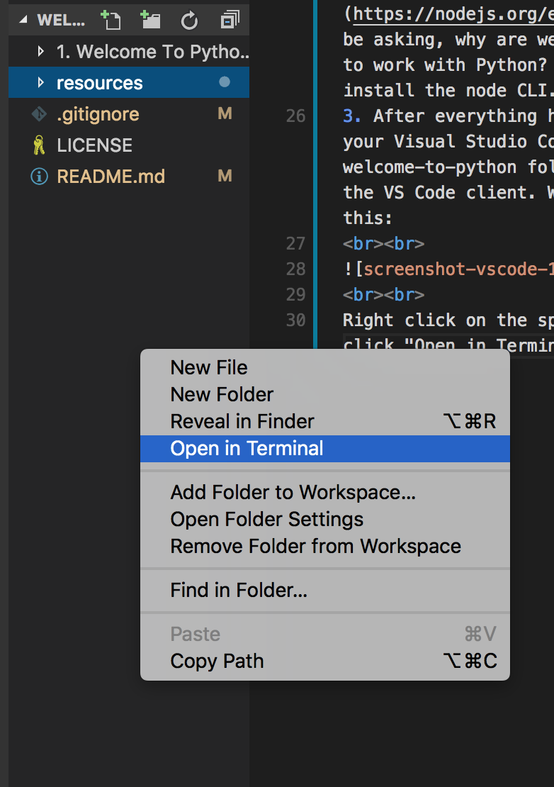

# Hi Vinh, welcome to Python 3
Here's a quick crash course on Python and important CS concepts (WIP lol). We won't focus too much on command line topics or Git, and we'll be relying on the GUI and CodeAcademy.

## Table of Contents
- [Introduction](#introduction)
- [Setup](#setup)
    - [VSCode](https://code.visualstudio.com/) : _universal code editor, works with terminal/cli_
    - Python 3 for [Windows](https://www.python.org/downloads/windows/) /
 [MacOS](https://www.python.org/downloads/mac-osx/) 
     - [Git basics](https://www.codecademy.com/learn/learn-git) (_optional_)
     - [Command Line Basics](https://www.codecademy.com/learn/learn-the-command-line) (_optional_)
     - Alternatively, you don't have to save your work on your computer if you run Python on an [online compiler](http://rextester.com/l/python3_online_compiler)
- [Module One](#module-one)

# Introduction
**What is Python?**
- A general purpose programming language from the 80s - although it's a bit of the older side it's still being used extensively today, with the 5th largest StackOverflow community, and one of the most in-demand languages in the data industry
- We'll be using Python 3 as opposed to Python 2. The big ideas between the two languagues are still the same, the syntax is just a bit different

**Why Python?**
- Python handles a lot of under-the-hood complexities for its user, so you can pretty much focus on writing code that functions without worrying about things like memory management
- Python is probably one of the better first imperative languages to learn because it's written like English. It's quite easy to pick up, and you don't have to worry about the low level problems you would encounter in a language like C++, yet it's strict enough to throw errors and will not fail silently (yikes, Javascript)
- You can also build backends, pipelines, mine data - you can do almost anything with Python

**How Will This Work?**
- The idea is that you learn syntax (how Python is written) and basic concepts from a free online resource: CodeAcademy. This has two major benefits, with the first being that I can skip an entire chapter of documentation on basic syntax, and the second being that we can focus more on algorithms and real world problem solving.
- You can also choose to either download Python and a text editor so you have it availiable offline, or you can skip the installation and use an online compiler.

# Setup
## Installation-Free Method:
http://rextester.com/l/python3_online_compiler
## Installing Python for Offline Use:
For the purposes of the tutorial, it's better to standardize our setup as much as possible. This way, when there's an error, we don't have to worry about error messages not matching, cross-platform inconsistencies, etc.

1. Begin by [Visual Studio Code](https://code.visualstudio.com/). We can quickly access the command line using VSCode, so that we don't have to constantly _cd_ into different folder structures.
2. Your next download is [Python](https://www.python.org/downloads/windows/). Make sure you download the correct version of Python (3.x) for your OS (Mac/Windows/Linux). We need this when we eventually run Python from our command line.
3. After everything has been installed, open up your Visual Studio Code. Drag and drop the welcome-to-python folder you've downloaded onto the VS Code client. We should have something like this:
  

  
Right click on the space below your workspace and click "Open in Terminal":
  

  
Now, let's check to see if we have Python installed properly.
  
_For Windows, type in: py to enter Python shell and then exit() to quit_
  
_For MacOS, Python 2.7 comes preinstalled, and that's the version that will be executed for what I assume to be backwards compatibility issues. We would type in python3 --version_ to check.
  

  
If everything is done correctly, Python 3.x.x should be installed! (If not, please find your nearest Ben and ask to debug)
  

   
4. Now type "python welcome.py" into your terminal. This effectively runs the Python file I've created. This should print something to your console. Congrats, Python is now working correctly on your machine!
_Note: In the future, if you save Python files to your computer, you have to be in the same directory as the file to run it!_

# Module One
## Syntax, Primitives, and Basic Math
_This module won't be too hefty - the main purpose is to understand primitives and basic syntax. We'll move faster and cover more ground in the later modules!_

Readings / Lecture:
Finish the first track (from 1 - 14) of the Python CodeAcademy course: https://www.codecademy.com/courses/learn-python/lessons/python-syntax/exercises/print-statements

_A really useful Code Academy track is the command line one - this gives you basic commands and allows you to nagivate through your system without the use of a GUI - super helpful when you're working in a directory on your command line and have to move to another, open a file, run tests, etc._

_A cheat sheet can be found here:_

_https://www.git-tower.com/blog/command-line-cheat-sheet/_

After you finish, try some of the excersies in this file (either create a new Python file and run it locally, or use the online compiler):

https://github.com/ben-che/welcome-to-python/blob/master/Module%20One/index.py

Answers will be found here:

https://github.com/ben-che/welcome-to-python/blob/master/Module%20One/answer.py

